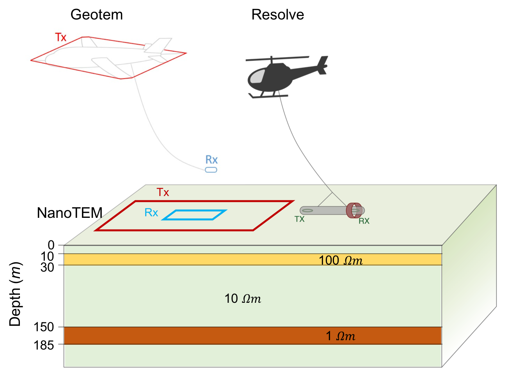

# 3D electromagnetic modelling and inversion - a case for open source

_Douglas W. Oldenburg, Lindsey J. Heagy, Seogi Kang and Rowan Cockett_

https://doi.org/10.1080/08123985.2019.1580118



## Summary

Electromagnetics has an important role to play in solving the next generation of geoscience problems. These problems are multidisciplinary, complex, and require collaboration. This is especially true at the base scientific level where the underlying physical equations need to be solved, and data, associated with physical experiments, need to be inverted. In this paper, we present arguments for adopting an open-source methodology for geophysics and provide some background about open-source software for electromagnetics. Immediate benefits are the reduced time required to carry out research, being able to collaborate, having reproducible results, and being able to disseminate results quickly. To illustrate the use of an open-source methodology in electromagnetics, we present two challenges. The first is to simulate data from a time domain airborne system over a conductive plate buried in a more resistive earth. The second is to jointly invert airborne TDEM and FDEM data with ground TDEM. SimPEG, Simulation and Parameter Estimation in Geophysics, (https://simpeg.xyz) is used for the open-source software. The figures in this paper can be reproduced by downloading the Jupyter Notebooks we provide with this paper (https://github.com/simpeg-research/oldenburg-2018-AEM). Access to the source code allows the researcher to explore the simulations and inversions by changing model and inversion parameters, plot fields and fluxes to gain further insight about the EM phenomena, and solve a new research problem by using open-source software as a base. By providing results in a manner that allows others to reproduce, further explore, and even extend them, we hope to demonstrate that an open-source paradigm has the potential to enable more rapid progress of the geophysics community as a whole.


## Citation

Oldenburg, D. W., Heagy, L. J., Kang, S., & Cockett, R. (2019). 3D electromagnetic modelling and inversion: a case for open source. Exploration Geophysics, 51(1), 25–37. https://doi.org/10.1080/08123985.2019.1580118

```
@article{oldenburgy_inversion_2020,
         author = {Douglas W. Oldenburg, Lindsey J. Heagy, Seogi Kang and Rowan Cockett},
         title = {3D electromagnetic modelling and inversion: a case for open source},
         journal = {Exploration Geophysics},
         volume = {51},
         number = {1},
         pages = {25--37},
         year = {2020},
         publisher = {Taylor \& Francis},
         doi = {10.1080/08123985.2019.1580118},
         URL = {https://doi.org/10.1080/08123985.2019.1580118}
}

```
